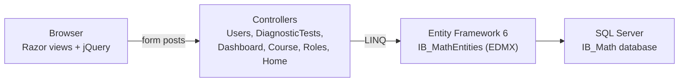

# IB Math

**A diagnostic test and course portal for IB Math students, built on ASP.NET MVC 5.**

Students register, sit a multiple-choice diagnostic test, and get a per-course score. Courses where they score under 70 are flagged and linked to study material. Teachers see the same breakdown for any student and manage the courses, questions, and roles behind it.

## What it does

- **Two roles from one sign-up form.** A user who enters a grade is stored as a student; one who leaves it blank is a teacher. Login is by email and password against the `Users` table, and a session cookie tracks who is signed in.
- **A one-time diagnostic test.** New students are sent straight to the test on first login. Every question has four options and a weightage tied to a course. Correct answers add that weightage to the student's score for that course, and a flag on the user stops the test from being offered again.
- **Per-course results.** The student dashboard lists each course with its score, marks anything under 70 in red, and links to the course PDF under `wwwroot/assets/pdf/`.
- **A teacher view.** Teachers pick a student from a dropdown and get the same course-by-course breakdown as a partial view.
- **CRUD admin pages.** Scaffolded controllers and Razor views for courses, diagnostic questions, roles, and users.

## How it works

Every request goes through a plain MVC pipeline: a Razor view posts to a controller, the controller reads or writes through an Entity Framework 6 database-first model (`Models/IB_MathModel.edmx`), and SQL Server holds the data. There is no API layer and no client-side framework beyond jQuery.



The login action decides where a user lands: a student who has not taken the test goes to `DiagnosticTests/Diagnostic_main`, a student who has goes to `Dashboard/courses`, and everyone else goes to `Dashboard/frontIndex`. `CustomAuthenticationFilter` redirects to the login page when the session has no user id.

The database has eight tables (`Users`, `Role`, `Courses`, `CourseQueAns`, `DiagnosticTest`, `DaigtestAns`, `UsersCourses`, `UsersDiagnostictest`) and two stored procedures for score totals. The controllers currently compute scores in C# rather than calling the procedures.

## Quick start

You need Windows with Visual Studio 2022, the .NET Framework 4.7.2 targeting pack, and a SQL Server instance.

**1. Create the database**

Run `DB_IBMath.sql` against your SQL Server. It creates the `IB_Math` database, the tables, and the stored procedures. The script is schema only, so add courses and questions through the admin pages after you sign in.

**2. Point the app at it**

Edit the `IB_MathEntities` connection string in `IB Math/Web.config` and replace the `data source`, `User id`, and `password` with your own. The checked-in values point at a remote server that you should not rely on.

**3. Run**

Open `IB Math.sln` in Visual Studio, restore NuGet packages, and press F5. IIS Express serves the site at `https://localhost:44304/` and the default route opens the login page at `/Users/Login`.

## Configuration

There are no environment variables. Everything lives in `IB Math/Web.config`.

| Setting | Purpose |
|---------|---------|
| `connectionStrings/IB_MathEntities` | EF6 connection string for the `IB_Math` database. The only thing you have to change. |
| `compilation debug` | `true` in the checked-in config. `Web.Release.config` turns it off on publish. |
| `Properties/PublishProfiles/FolderProfile.pubxml` | Folder publish profile used to produce the compiled build. |

## Project layout

```
IB Math.sln
DB_IBMath.sql                  Database, tables, and stored procedures
IB Math/
├── App_Start/                 Routes (default: Users/Login) and global filters
├── Authentication Filter/     Session-based auth filter
├── Controllers/               Users, DiagnosticTests, Dashboard, Course, Roles, Home
├── Models/                    EF6 database-first model (EDMX) and metadata classes
├── Views/                     Razor views; Shared/ holds the admin and front layouts
├── wwwroot/assets/            Admin theme CSS/JS, images, and the course PDF
└── Web.config                 Connection string and framework settings
images/IB/                     Topic images (NA, CAL, SP, GT, FUN), not referenced by the code
IB_Math.zip                    Snapshot of the source tree
compiled_code_IBMath.zip       Published build output
```

## Limitations

- Passwords are stored and compared in plain text.
- The diagnostic test grades answers by list position, so it assumes the posted list matches the order of `DiagnosticTests` in the database.
- Anti-forgery tokens are commented out on the form posts.
- The default admin theme ships with many unused scripts and assets under `wwwroot/assets/`.
- There are no tests.
